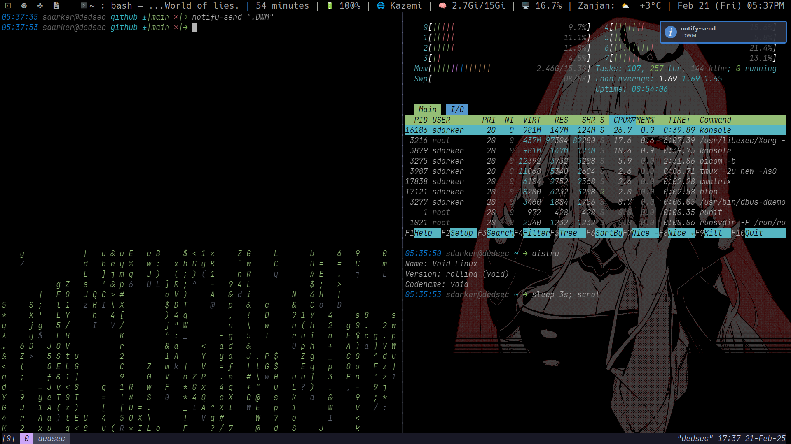
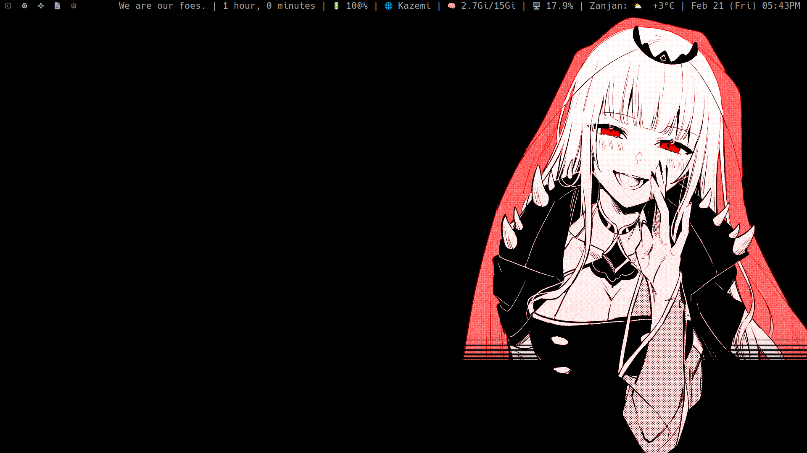

# Dwm-Dots

## Overview

Welcome to the `dwm-dots` repository! This project contains my personal configuration files for [dwm](https://dwm.suckless.org/), a dynamic window manager for X11, along with a customized setup for `dwmblocks`. My configuration is designed to provide a sleek, dark-themed environment that enhances productivity and visual appeal.

## Features

- **Dark Theme**: A visually pleasing dark theme that reduces eye strain and enhances focus during long coding sessions.
- **Custom Keybindings**: Efficient keybindings tailored to streamline window management and navigation.
- **dwmblocks Integration**: A customized status bar using `dwmblocks` that displays essential information such as system stats, time, and notifications.
- **Patches**: Includes useful patches that extend dwm's functionality, such as:
  - Floating windows
  - Status bar enhancements
  - Custom layouts
  - Some Shell Scripts For System Status

# Dependencies

You Will Need **Slock** For Screen Locker And The **Dwm** Package And Konsole Terminal Installed(i need Konsole because it has good support for rtl language)

# Install Dependencies

**We Use Void So We Install Using Xbps:)**

```bash
sudo xbps-install base-devel libX11-devel libXft-devel libXinerama-devel freetype-devel fontconfig-devel dwm slock konsole make cmake git curl picom -y # Picom And Slock Is Not Nessury But They Are So Good.
```

## Installation

### Automatic

```bash
curl -sSL https://raw.githubusercontent.com/CrypticSpider/dwm-dots/main/install.sh | bash
```

## Install Manualy

To set up my dwm configuration, follow these steps:

1. **Clone the Repository**:
   ```bash
   git clone https://github.com/CrypticSpider/dwm-dots.git
   cd dwm-dots
   ```
2. **Copy Configuration Files**:
   Copy the configuration files to the appropriate directories:

```bash
mkdir -p ~/.config/dwm/ \
mkdir -p ~/.config/dwmblocks/ \
cp -R dwm/* ~/.config/dwm/ \
cp -R dwmblocks/* ~/.config/dwmblocks/
```

3. **Copy Scripts**:

```bash
mkdir -p ~/.local/bin/ && cp -R statusbar/ ~/.local/bin/
```

4. **Compile dwm and dwmblocks**:
   If you haven't already, compile both dwm and dwmblocks with the new configurations:

```bash
make -C ~/.config/dwm clean install && make -C ~/.config/dwmblocks clean install
```

### Customize Konsole Terminal To A Better Dark Theme.

```bash
cp -v konsole-themes/One\ Dark\ Color.colorscheme ~/.local/share/konsole/
```

For Font Install The JetBrainsMonoNL Font And Then Selecte It In The Konsole Configuration.

## Changing The Default Terminal

**You Can Change This Line In The Config File To Define Your Desired Terminal**:

**Edit the ~/.config/dwm/config.h**

```bash
static const char \*termcmd[] = { "konsole", NULL }; # change konsole to any terminal you use.
```

**Feel Free To Customize Anything There:)**

## You Can Also Copy The Picom Configuration

```bash
if ! [ -d ~/.config/picom ]; then
mkdir -p ~/.config/picom/
cp -rv picom/* ~/.config/picom/
```

# If You Use Alsa As Audio Server:

You Can Use My .asoundrc Config, Works Fine On ThinkPad

```bash
cp -fv .asoundrc ~/
```

# Start Dwm With New Configs

**Use .xinitrc If You Don't Use Display Manager**

```bash
cp .xinitrc ~/
```

**If You Want Use .xinitrc, Then You Can Run Dwm When Your Shell Start**

Add The Following To Your .shellnamerc:

```bash
if [[ `tty` == '/dev/tty1' ]]; then
    startx
fi
```

### Now Restart dwm And Enjoy New Config(by Doing WIN + Q)

Restart dwm to apply the new configuration and enjoy your dark-themed setup!
You can restart by doing WIN + Q(related on configuration)

# Usage

## Keybindings

Utilize the custom keybindings to manage windows efficiently. Refer to the configuration file for a complete list of keybindings.

**Launch Terminal By Doing WIN + x.**

**Launch Rofi By Doint WIN + r.**

**Full Screen By Doing WIN + m.i**

**Launch FireFox Browser By Doing WIN + b.**

**Exit Dwm By Doing WIN + Q.**

## Status Bar

The dwmblocks status bar will display real-time information, including system stats and notifications And Some Words. Customize the scripts in the dwmblocks directory and the ~/.local/bin/statusbar directory to modify what is displayed.
