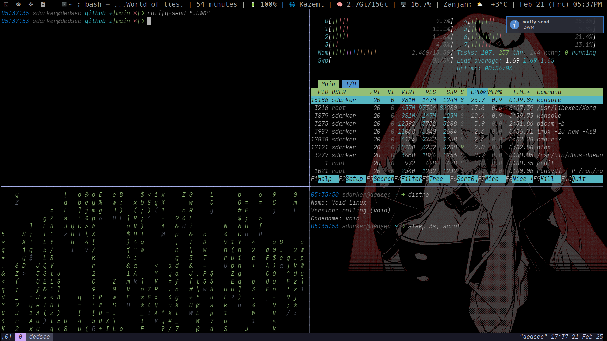
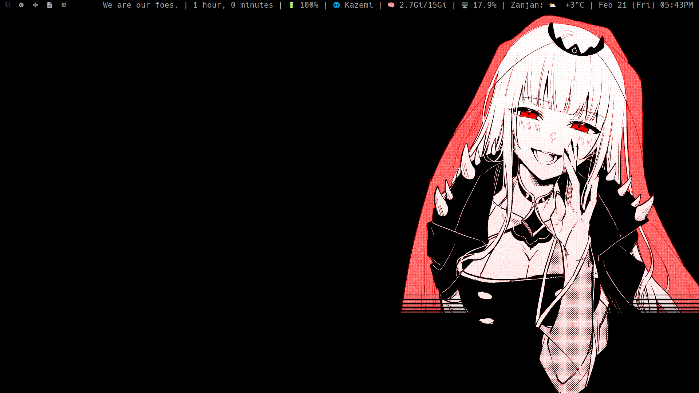

# dwm-dots

## Overview

Welcome to the `dwm-dots` repository! This project contains my personal configuration files for [dwm](https://dwm.suckless.org/), a dynamic window manager for X11, along with a customized setup for `dwmblocks`. My configuration is designed to provide a sleek, dark-themed environment that enhances productivity and visual appeal.

## Features

- **Dark Theme**: A visually pleasing dark theme that reduces eye strain and enhances focus during long coding sessions.
- **Custom Keybindings**: Efficient keybindings tailored to streamline window management and navigation.
- **dwmblocks Integration**: A customized status bar using `dwmblocks` that displays essential information such as system stats, time, and notifications.
- **Patches**: Includes useful patches that extend dwm's functionality, such as:
  - Floating windows
  - Status bar enhancements
  - Custom layouts

# Install Dwm

**We Use Void So We Install Using Xbps:)**

```bash
sudo xbps-install dwm -y
```

## Installation

### Automatic:

```bash
chmod +x install.sh && ./install.sh
```

## Install Manualy:

To set up my dwm configuration, follow these steps:

1. **Clone the Repository**:
   ```bash
   git clone https://github.com/CrypticSpider/dwm-dots.git
   cd dwm-dots
   ```
2. **Copy Configuration Files**:
   Copy the configuration files to the appropriate directories:

```bash
cp -R dwm/* ~/.config/dwm/ \
cp -R dwmblocks/* ~/.config/dwmblocks/
```

3. **Copy Scripts**:

```bash
mkdir -p ~/.local/bin/ && cp -R statusbar/ ~/.local/bin/
```

4. **Compile dwm and dwmblocks**:
   If you haven't already, compile both dwm and dwmblocks with the new configurations:

```bash
cd ~/.config/dwm/ \
make clean install \

cd ~/.config/dwmblocks/ \
make clean install
```

5. **Use .xinitrc If You Don't Use Display Manager**

```bash
cp .xinitrc ~/
```

6. **Restart dwm**:
   Restart dwm to apply the new configuration and enjoy your dark-themed setup!
   You can restart by doing CTRL + Q(related on configuration)

# Usage

**Keybindings**: Utilize the custom keybindings to manage windows efficiently. Refer to the configuration file for a complete list of keybindings.
**Status Bar**: The dwmblocks status bar will display real-time information, including system stats and notifications. Customize the scripts in the dwmblocks directory to modify what is displayed.

# ScreenShot :



